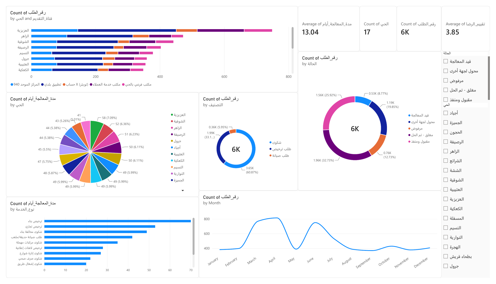

# Municipal Services Analytics Dashboard — Power BI



## Overview

An interactive Power BI dashboard analyzing municipal service requests — complaints, license applications, and maintenance requests — submitted by citizens through multiple channels. The dashboard tracks service performance by neighborhood, request type, and season, with a focus on processing-time bottlenecks and citizen satisfaction.

This project was inspired by hands-on experience gained during a Data Analyst internship at the Holy Makkah Municipality. **The dataset is synthetic** — it does not contain real or official municipal records — but it was designed to reflect a realistic structure of service types, neighborhood distribution, seasonal demand patterns (Ramadan and Hajj), and request lifecycles, based on first-hand exposure to how this kind of data is structured in practice.

## Business Questions

1. What is the average processing time per service type and neighborhood, and where are the bottlenecks?
2. Do complaint volumes rise and processing times slow down during peak seasons?
3. Which submission channels do citizens use most, and are they linked to faster resolution?
4. Which neighborhoods have the highest rate of recurring complaints (cleanliness, encroachment, lighting)?
5. What share of requests are rejected or referred elsewhere?
6. How does citizen satisfaction relate to processing time?

## Data Dictionary

The Power BI file uses Arabic field names (matching how this type of data is recorded in practice at Saudi municipal systems). English equivalents below for reference:

| Field (Arabic) | Field (English) | Description |
|---|---|---|
| رقم_الطلب | Request_ID | Unique request identifier |
| تاريخ_التقديم | Submission_Date | Date the request was submitted |
| تاريخ_الإغلاق | Closure_Date | Date the request was closed |
| الحي | Neighborhood | District the request belongs to (17 Makkah neighborhoods) |
| نوع_الخدمة | Service_Type | Detailed request type (12 types) |
| التصنيف | Category | Complaint / License Request / Maintenance Request |
| قناة_التقديم | Submission_Channel | Balady App, Unified Call Center 940, Customer Service Office, etc. |
| الحالة | Status | Current request status |
| مدة_المعالجة_أيام | Processing_Days | Days from submission to closure |
| تقييم_الرضا | Satisfaction_Rating | Citizen rating, 1–5 |
| موسم_ذروة | Peak_Season | Whether the request fell during Ramadan or Hajj |

Dataset: `data/municipal_services_makkah.csv` — 6,000 synthetic records spanning 2023–2024.

## Dashboard Contents

**KPI Cards:** Total requests, average processing time, average satisfaction rating, completion rate.

**Visuals:**
- Monthly request volume trend (highlights Ramadan/Hajj spikes)
- Request distribution by category (Complaint / License / Maintenance)
- Request distribution by status
- Request volume and processing time by neighborhood
- Average processing time by service type (top bottlenecks)
- Request volume by channel and neighborhood

**Interactivity:** Slicers for Status and Neighborhood, cross-filtering across all visuals.

## Key DAX Measures

```DAX
Avg Processing Time = AVERAGE(municipal_services_makkah[مدة_المعالجة_أيام])

Total Requests = COUNTROWS(municipal_services_makkah)

Completion Rate =
DIVIDE(
    CALCULATE(COUNTROWS(municipal_services_makkah), municipal_services_makkah[الحالة] IN {"مغلق - تم الحل","مقبول ومنفذ"}),
    COUNTROWS(municipal_services_makkah)
)

Avg Satisfaction = AVERAGE(municipal_services_makkah[تقييم_الرضا])
```

## Key Insights

- Processing time varies significantly by service type — building permits and construction-violation complaints take the longest to resolve, while cleanliness and vendor complaints are closed fastest.
- Request volume spikes noticeably during Ramadan and Hajj periods, with processing times increasing in parallel due to higher load.
- The Balady app is the dominant submission channel across nearly all neighborhoods.
- Roughly a third of all requests are license applications, with the remainder split between complaints and maintenance requests.

## Repository Structure

```
├── pbix/
│   └── municipal_services_makkah.pbix
├── data/
│   └── municipal_services_makkah.csv
├── assets/
│   └── dashboard_preview.png
└── README.md
```

## Tools Used

Power BI Desktop · Power Query · DAX


